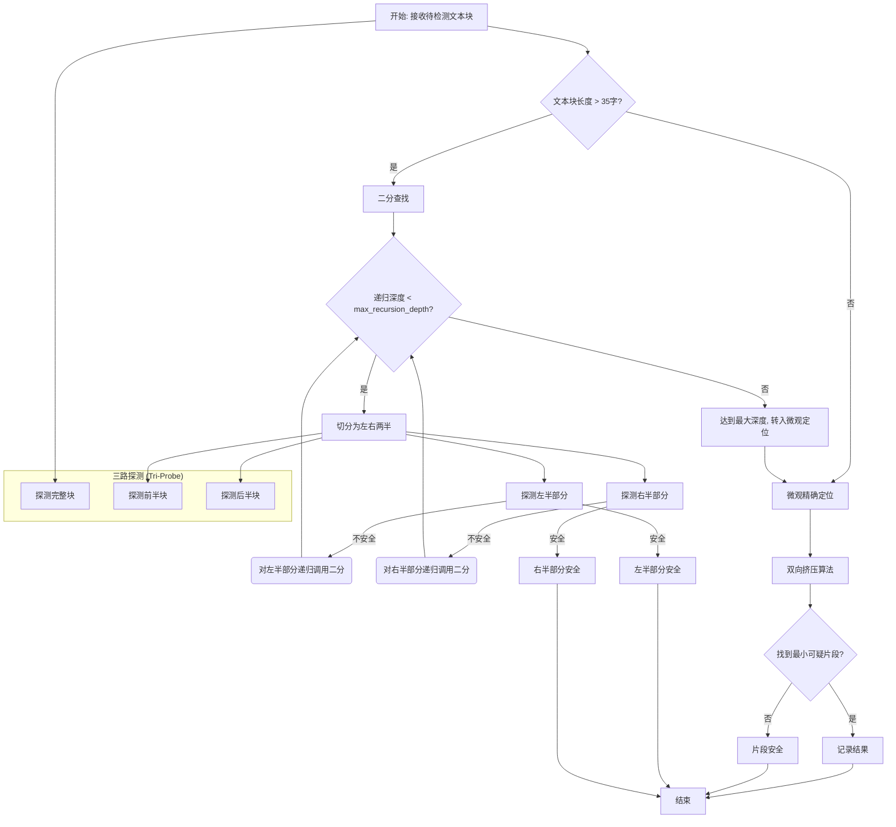

# 参数配置参考手册

## 目录

1. [配置文件位置](#配置文件位置)
2. [参数总览](#参数总览)
3. [高级设置详解（settings）](#高级设置详解settings)
4. [算法参数详解（algorithm）](#算法参数详解algorithm)
5. [算法原理与参数关联](#算法原理与参数关联)
6. [API 凭证配置](#api-凭证配置)
7. [预设规则配置（presets）](#预设规则配置presets)
8. [参数调优指南](#参数调优指南)
9. [配置验证清单](#配置验证清单)
10. [常见问题 FAQ](#常见问题-faq)

---

## 配置文件位置

```
config/
├── API/credentials.json        # 上游 API 地址与密钥
├── settings/default.json       # 全局高级设置（系统默认）
├── settings/user.json          # 用户覆盖项（可选）
├── presets/official.json       # 官方 API 规则
├── presets/relay.json          # 中转服务规则（默认）
└── algorithm/default.json      # 算法参数
```

---

## 参数总览

### 高级设置（settings/default.json）

| 参数 | 默认值 | 范围/可选值 | 说明 |
|------|--------|-------------|------|
| preset | relay | relay/official/custom | 使用的规则预设 |
| concurrency | 15 | 1-50 | 最大并发请求数 |
| timeout_seconds | 30 | 5-60 | 单请求超时时间（秒） |
| chunk_size | 30000 | 100-50000 | 初次分块大小（字符） |
| max_retries | 3 | 0-10 | 失败重试次数 |
| min_granularity | 1 | 1-10 | 二分最小粒度（字符） |
| overlap_size | 12 | 5-50 | 分块重叠大小（字符） |
| algorithm_mode | hybrid | hybrid/binary | 扫描算法模式 |
| algorithm_switch_threshold | 35 | 20-100 | 宏观二分转微观扫描的切换阈值（字符） |
| use_system_proxy | true | true/false | 是否使用系统代理 |

### 算法参数（algorithm/default.json）

| 参数 | 默认值 | 说明 |
|------|--------|------|
| algorithm_switch_threshold | 35 | 宏观二分转微观扫描的切换阈值（字符） |
| enable_triple_probe | true | 启用三路探测，确保切割判断的完备性 |
| max_recursion_depth | 30 | 二分递归最大层数 |
| enable_deduplication | true | 启用结果去重 |
| dedup_overlap_threshold | 0.5 | 去重重叠阈值（0-1） |
| dedup_adjacent_distance | 30 | 去重相邻距离（字符） |
| enable_middle_chunk_probe | true | 启用中间块探测 |
| middle_chunk_overlap_factor | 1.0 | 中间块重叠因子 |

---

## 高级设置详解（settings）

以下示例文件：`config/settings/default.json` 或 `config/settings/user.json`

### 1) preset（预设规则）
- 类型：String
- 默认值："relay"
- 可选值："relay" | "official" | "custom"
- 说明：选择规则预设，影响拦截/重试策略

### 2) concurrency（并发数）
- 类型：Integer，范围 1-50，默认 15
- 说明：并发请求上限。越大速度越快，但越易触发限流
- 建议：开发 15-20；快速 30-40；稳定 1-10（低压运行）

### 3) timeout_seconds（超时时间）
- 类型：Integer，范围 5-60，默认 30
- 说明：单请求超时（秒）。网络不稳适当上调

### 4) chunk_size（分块大小）
- 类型：Integer，范围 100-50000，默认 30000
- 说明：初次分块字符数。长文本可调大以减少块数

### 5) max_retries（最大重试次数）
- 类型：Integer，范围 0-10，默认 3
- 说明：失败后的最大重试次数。限流或 5xx 时生效

### 6) min_granularity（最小粒度）
- 类型：Integer，范围 1-10，默认 1
- 说明：二分查找的最小字符粒度。越小越精确，调用更多

### 7) overlap_size（重叠大小）
- 类型：Integer，范围 5-50，默认 12
- 说明：分块间重叠字符数。
- 原理：重叠能覆盖跨块边界的敏感词，建议 ≥ 2× 可能的“最长敏感词长度”。

### 8) algorithm_mode（算法模式）
- 类型：String，默认 "hybrid"
- 可选："hybrid"（推荐）| "binary"
- 说明：hybrid 基于长度二分与双向压缩算法精确间切换

### 9) algorithm_switch_threshold（算法切换阈值）【新增】
- 类型：Integer，范围 20-100，默认 35
- 说明：宏观二分转微观扫描的临界点。当文本片段长度小于或等于此值时，停止二分查找，启动微观精确扫描。
- **【重要】强依赖关系**：必须满足 `algorithm_switch_threshold > 2 × overlap_size`，否则会导致无限递归（死循环）。
- 建议值：
  - 30-40：推荐值，平衡二分和精确定位的效率（默认 35）
  - 20-30：更多使用精确定位，精度更高但速度较慢
  - 40-60：更多使用二分查找，速度更快但可能精度略低

### 10) use_system_proxy（系统代理）
- 类型：Boolean，默认 true
- 说明：是否使用系统代理配置

---

## 算法参数详解（algorithm）

文件：`config/algorithm/default.json`

### 1) enable_triple_probe（三路探测）
- Boolean，默认 true
- 作用：在对文本段进行切分判断时，通过探测“完整、前半、后半”三个部分，避免因切割位置不当（例如恰好在敏感词中间切开）导致模型无法识别而产生的漏判。

### 2) max_recursion_depth（最大递归深度）
- Integer，默认 30（建议 25-40）
- 作用：限制二分迭代层数，过小可能无法收敛到词汇级范围，过大则增加调用量。

### 3) enable_deduplication（去重）
- Boolean，默认 true
- 作用：合并重复或高度重叠命中，输出更简洁稳定。

### 4) dedup_overlap_threshold（重叠阈值）
- Float，默认 0.5
- 判定：`overlap_ratio = overlap_len / min(len_a, len_b)`，当 overlap_ratio ≥ 阈值时视为同一命中。

### 5) dedup_adjacent_distance（相邻距离）
- Integer，默认 30
- 作用：相距小于该值的命中可按策略合并，避免碎片化结果。

### 6) enable_middle_chunk_probe（中间块探测）
- Boolean，默认 true
- 作用：在二分过程中对“中间块”加一步探测，防止仅左右边界探测导致的遗漏。

### 7) middle_chunk_overlap_factor（中间块重叠因子）
- Float，默认 1.0
- 作用：控制中间块与左右块重叠度，适当增加可提高边界稳定性。

---

## 算法原理与参数关联

### 核心思路
- **二分（Binary Search）**：当候选文本较长（例如 > 35 字）时，通过递归二分快速缩小“可疑区间”。
- **双向挤压（Precision Scan）**：当区间足够短（≤ 35 字）时，使用双向挤压法，逐字收缩，直至最小可疑片段收敛到词汇级。
- **三路探测（Tri-Probe）**：在切分判断时，对“完整、前半、后半”部分进行探测，旨在避免因切割位置不当（例如在敏感词中间切开）而导致的漏判，确保判断的完备性。
- **动态掩码（Dynamic Masking）**：发现命中后进行全局掩码，随后的请求不再重复触发相同拦截，提高总体吞吐。

### 算法流程图 (Mermaid)



### 伪代码示例

```pseudocode
function hybrid_scan(text):
  if length(text) > algorithm_switch_threshold:
    return binary_search_scan(text, depth=0)
  else:
    return precision_scan(text)

function binary_search_scan(text, depth):
  if depth >= max_recursion_depth or length(text) <= algorithm_switch_threshold:
    return precision_scan(text)

  // 三路探测确保切割的完备性
  probe_full = probe_api(text)
  if probe_full is SAFE:
    return SAFE

  left_half, right_half = split(text)

  probe_left = probe_api(left_half)
  if probe_left is NOT_SAFE:
    binary_search_scan(left_half, depth + 1)

  probe_right = probe_api(right_half)
  if probe_right is NOT_SAFE:
    binary_search_scan(right_half, depth + 1)

function precision_scan(text):
  // 双向挤压，从两端逐字收缩
  // ... 实现细节 ...
  return min_sensitive_fragment
```

### 关键参数与效果
- **algorithm_switch_threshold**：二分与精确定位的切换点。越小越精确但速度慢，越大速度快但可能精度略低。默认 35，推荐 30-50。
  - **【重要】必须满足：threshold > 2 × overlap_size，否则导致死循环**
- **overlap_size**：决定跨块边界是否会遗漏命中。若最长敏感词为 L，建议 overlap ≥ 2×L，以覆盖边界两侧搜索空间。
- **max_recursion_depth**：决定二分算法能否在有限步内收敛到短区间；文本更长或阈值更苛刻时可上调。
- **algorithm_mode**：使用 `hybrid` 可自动在 Binary/Precision 之间切换，通常兼顾速度与精度。
- **concurrency/timeout/max_retries**：影响吞吐与稳定性；在限流或高延迟环境下降低并发、提高超时并减少重试峰值更稳妥。

### 【重要】死循环防护公式

**二分切分后的片段长度计算**：
```
新片段长度 ≈ (原片段长度 / 2) + overlap_size
```

**死循环条件**（必须避免）：
```
新片段长度 ≥ 原片段长度
即：(len / 2) + overlap_size ≥ len
即：overlap_size ≥ len / 2
```

**安全条件**（必须满足）：
```
algorithm_switch_threshold > 2 × overlap_size
```

**示例**：
- ✓ 安全：threshold=40, overlap=12 → 40 > 24
- ✗ 危险：threshold=25, overlap=15 → 25 ≤ 30（会导致死循环）
- ✓ 安全：threshold=50, overlap=15 → 50 > 30

---

## API 凭证配置

文件：`config/API/credentials.json`

- **api_url**：上游 API 的基础地址 (e.g., `https://api.openai.com/v1`)
- **api_key**：API 认证密钥 (e.g., `sk-...`)
- **api_model**：使用的 LLM 模型 (e.g., `gpt-4o-mini`)

> **安全建议**：勿将 `credentials.json` 提交到版本库，建议使用 `.gitignore` 排除。

---

## 预设规则配置（presets）

文件：`config/presets/official.json | relay.json | custom.json`

常见字段：
- **block_status_codes**：触发“已拦截”的 HTTP 状态码列表。
- **block_keywords**：响应包含这些关键词视为拦截。
- **retry_status_codes**：触发自动重试的状态码列表。

---

## 参数调优指南

- **问题 1：扫描速度慢**
  - 调高 `concurrency` (e.g., 30)，调低 `timeout_seconds` (e.g., 15)，适当增大 `min_granularity` (e.g., 3)。
- **问题 2：定位不够精确**
  - 调低 `min_granularity` (e.g., 1)，增大 `overlap_size` (e.g., 15)，调高 `max_recursion_depth` (e.g., 40)。
- **问题 3：疑似遗漏敏感词**
  - 增大 `overlap_size` (e.g., 20)，调低 `chunk_size` (e.g., 20000)，检查 `preset` 规则。
- **问题 4：限流/错误频发**
  - 调低 `concurrency` (e.g., 10)，减少 `max_retries` (e.g., 2)，增大 `timeout_seconds` (e.g., 40)。

---

## 配置验证清单

- [ ] `api_url` 与 `api_key` 有效且未泄露。
- [ ] `api_model` 被上游 API 支持。
- [ ] `min_granularity` = 1（默认高精度）。
- [ ] `overlap_size` ≥ 2× 预计最长敏感词长度。
- [ ] `preset` 选择合理（relay/official/custom）。
- [ ] `algorithm_mode` 为 `hybrid`（推荐）。
- [ ] `concurrency/timeout/max_retries` 与网络环境匹配。

---

## 常见问题 FAQ

- **Q1：修改配置后需要重启吗？**
  - 不需要。系统支持配置热重载，新任务自动生效。
- **Q2：如何在不同环境使用不同配置？**
  - 将差异项写入 `config/settings/user.json`，它会覆盖 `default.json` 的同名配置。
- **Q3：为什么仍然出现遗漏？**
  - 提高 `overlap_size`，确保使用 `hybrid` 模式，并保持 `min_granularity = 1`。
- **Q4：如何在高延迟网络下稳定运行？**
  - 提高 `timeout_seconds` 至 40-60，并降低 `concurrency` 至 1-10。
