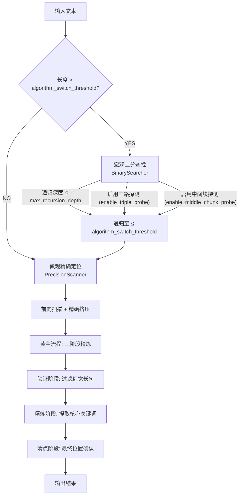

# 参数配置参考手册

## 目录

1.  [配置文件位置](#配置文件位置)
2.  [参数总览](#参数总览)
3.  [高级设置详解（settings）](#高级设置详解settings)
4.  [算法参数详解（algorithm）](#算法参数详解algorithm)
5.  [算法原理与参数关联](#算法原理与参数关联)
6.  [并发与实现机制](#并发与实现机制)
7.  [API 凭证配置](#api-凭证配置)
8.  [预设规则配置（presets）](#预设规则配置presets)
9.  [参数调优指南](#参数调优指南)
10. [配置验证清单](#配置验证清单)
11. [常见问题 FAQ](#常见问题-faq)

---

## 配置文件位置

```
config/
├── API/credentials.json        # 上游 API 地址与密钥
├── settings/default.json       # 全局高级设置（系统默认）
├── settings/user.json          # 用户覆盖项（可选）
├── presets/official.json       # 官方 API 规则
├── presets/relay.json          # 中转服务规则（默认）
└── algorithm/default.json      # 算法参数
```

---

## 参数总览

### 高级设置（settings/default.json）

| 参数 | 默认值 | 范围/可选值 | 说明 |
| :--- | :--- | :--- | :--- |
| preset | relay | relay/official/custom | 使用的规则预设 |
| concurrency | 15 | 1-50 | 最大并发请求数 |
| timeout_seconds | 30 | 5-60 | 单请求超时时间（秒） |
| chunk_size | 30000 | 100-50000 | 初次分块大小（字符） |
| max_retries | 3 | 0-10 | 失败重试次数 |
| min_granularity | 1 | 1-10 | 二分最小粒度（字符） |
| overlap_size | 12 | 5-50 | 分块重叠大小（字符） |
| algorithm_mode | hybrid | hybrid/binary | 扫描算法模式 |
| algorithm_switch_threshold | 35 | 20-100 | 宏观二分转微观扫描的切换阈值（字符） |
| use_system_proxy | true | true/false | 是否使用系统代理 |

### 算法参数（algorithm/default.json）

| 参数 | 默认值 | 说明 |
| :--- | :--- | :--- |
| algorithm_switch_threshold | 35 | 宏观二分转微观扫描的切换阈值（字符） |
| enable_triple_probe | true | 启用三路探测，确保切割判断的完备性 |
| max_recursion_depth | 30 | 二分递归最大层数 |
| enable_deduplication | true | 启用结果去重 |
| dedup_overlap_threshold | 0.5 | 去重重叠阈值（0-1） |
| dedup_adjacent_distance | 30 | 去重相邻距离（字符） |
| enable_middle_chunk_probe | true | 启用中间块探测 |
| middle_chunk_overlap_factor | 1.0 | 中间块重叠因子 |

---

## 高级设置详解（settings）

以下示例文件：`config/settings/default.json` 或 `config/settings/user.json`

### 1) preset（预设规则）
-   **类型**：String
-   **默认值**："relay"
-   **可选值**："relay" | "official" | "custom"
-   **说明**：选择规则预设，影响拦截/重试策略。

### 2) concurrency（并发数）
-   **类型**：Integer，范围 1-50，默认 15
-   **说明**：并发请求上限。数值越大速度越快，但越容易触发限流。
-   **建议**：开发测试 15-20；追求速度 30-40；稳定运行 1-10（低压模式）。

### 3) timeout_seconds（超时时间）
-   **类型**：Integer，范围 5-60，默认 30
-   **说明**：单个请求的超时时间（秒）。若网络环境不稳定，可适当上调。

### 4) chunk_size（分块大小）
-   **类型**：Integer，范围 100-50000，默认 30000
-   **说明**：处理长文本时的初次分块字符数。文本越长，可适当调大以减少分块数量。

### 5) max_retries（最大重试次数）
-   **类型**：Integer，范围 0-10，默认 3
-   **说明**：当请求因限流或服务器错误（如5xx）失败后的最大重试次数。

### 6) min_granularity（最小粒度）
-   **类型**：Integer，范围 1-10，默认 1
-   **说明**：二分查找算法的最小字符粒度。数值越小，定位越精确，但API调用次数会相应增加。

### 7) overlap_size（重叠大小）
-   **类型**：Integer，范围 5-50，默认 12
-   **说明**：文本分块之间的重叠字符数。
-   **原理**：设置重叠区域是为了确保能够完整覆盖那些跨越分块边界的敏感词。建议设置为可能出现的“最长敏感词长度”的2倍以上。

### 8) algorithm_mode（算法模式）
-   **类型**：String
-   **默认值**："hybrid"
-   **可选值**："hybrid" | "binary"
-   **说明**：
    -   `"hybrid"`：混合模式（推荐），系统会根据文本长度自动在宏观二分和微观精确定位算法之间切换。
    -   `"binary"`：纯二分模式，始终使用二分查找算法。

### 9) algorithm_switch_threshold（切换阈值）
-   **类型**：Integer，范围 20-100，默认 35
-   **说明**：在混合模式下，从宏观二分查找切换到微观精确定位算法的文本长度阈值（字符）。
-   **原理**：当待处理的文本片段长度小于或等于此阈值时，算法将切换至精度更高的扫描方式。
-   **调优**：
    -   **较小值 (20-30)**：更早切换到精确扫描，精度高但API调用多。
    -   **较大值 (50-100)**：更多地使用二分查找，速度快但对极短词的定位精度可能下降。
-   **安全检查**：为防止潜在的死循环，必须满足 `algorithm_switch_threshold > 2 × overlap_size`。

### 10) use_system_proxy（系统代理）
-   **类型**：Boolean
-   **默认值**：true
-   **说明**：设置是否使用操作系统配置的系统代理。

---

## 算法参数详解（algorithm）

以下示例文件：`config/algorithm/default.json`

### 1) algorithm_switch_threshold（切换阈值）
-   **类型**：Integer，范围 20-100，默认 35
-   **说明**：同 settings 中的定义，建议两处配置保持一致。

### 2) enable_triple_probe（三路探测）
-   **类型**：Boolean，默认 true
-   **说明**：在二分查找过程中，对中点位置进行左、中、右三路探测，以确保切割判断的完备性与准确性。

### 3) max_recursion_depth（最大递归深度）
-   **类型**：Integer，范围 1-50，默认 30
-   **说明**：二分查找算法的最大递归层数，用于防止因切分过细导致的无限递归。

### 4) enable_deduplication（启用去重）
-   **类型**：Boolean，默认 true
-   **说明**：启用扫描结果的自动去重功能，消除重复或高度重叠的敏感词。

### 5) dedup_overlap_threshold（去重重叠阈值）
-   **类型**：Float，范围 0-1，默认 0.5
-   **说明**：判断两个结果是否为重复项的重叠度阈值。如果两个结果的重叠部分占比较高（≥ 阈值），则被视为重复。

### 6) dedup_adjacent_distance（去重相邻距离）
-   **类型**：Integer，范围 1-100，默认 30
-   **说明**：判断两个结果是否相邻的距离阈值（字符）。如果两个结果之间的距离小于等于此阈值，则被视为相邻。

### 7) enable_middle_chunk_probe（启用中间块探测）
-   **类型**：Boolean，默认 true
-   **说明**：在处理分块时，启用对分块连接处的中间块进行额外探测，确保不遗漏跨块边界的敏感词。

### 8) middle_chunk_overlap_factor（中间块重叠因子）
-   **类型**：Float，范围 0.5-2.0，默认 1.0
-   **说明**：计算中间块大小时的重叠因子，公式为：`实际重叠大小 = overlap_size × middle_chunk_overlap_factor`。

---

## 算法原理与参数关联

### 混合算法流程



### 参数调优建议

| 场景 | 推荐配置 | 说明 |
| :--- | :--- | :--- |
| **精度优先** | `algorithm_switch_threshold: 20-30`<br>`min_granularity: 1`<br>`enable_triple_probe: true` | 更早切换到精确扫描，使用更细的粒度。 |
| **速度优先** | `algorithm_switch_threshold: 50-70`<br>`min_granularity: 5`<br>`enable_triple_probe: false` | 更多地使用二分查找，采用更粗的粒度。 |
| **平衡模式** | `algorithm_switch_threshold: 35`<br>`min_granularity: 1`<br>`enable_triple_probe: true` | 默认配置，平衡精度和速度。 |
| **网络不稳** | `max_retries: 5`<br>`timeout_seconds: 45`<br>`concurrency: 5-10` | 增加重试次数和超时时间，同时降低并发。 |

---

## 并发与实现机制

### 并发控制

系统使用 `asyncio.Semaphore` 实现并发控制，确保同时进行的 API 请求数量不超过 `concurrency` 的设定值。

```python
semaphore = asyncio.Semaphore(concurrency)

async with semaphore:
    # 此处执行 API 请求
    response = await api_call()
```

### 重试机制

系统集成了 `tenacity` 库，实现了强大的自动重试机制。

```python
@retry(
    stop=stop_after_attempt(max_retries),
    wait=wait_exponential(multiplier=1, min=2, max=10),
    retry=retry_if_exception_type((NetworkError, TimeoutError))
)
async def api_call():
    # 执行 API 请求
    pass
```

-   **重试策略**：采用指数退避策略（例如 2s → 4s → 8s...），并支持对多种网络异常进行自动重试。

### 掩码机制

系统通过全局掩码管理器实现“等长延迟掩码”，以减少不必要的 API 调用。

```python
# 获取已知的敏感词列表
known_words = mask_manager.get_masked_words()

# 将已知敏感词替换为等长的 '*'
masked_text = apply_mask(text, known_words)

# 如果文本被完全掩码，则跳过本次 API 请求
if not masked_text.strip():
    return
```

-   **特性**：
    -   **等长替换**：保持文本坐标系不变。
    -   **延迟应用**：在即将发送请求前应用掩码，最大化利用并发任务的发现成果。
    -   **请求优化**：若文本被完全掩码，则直接跳过该次 API 调用。

---

## API 凭证配置

**文件位置**：`config/API/credentials.json`

```json
{
  "api_url": "https://api.openai.com/v1",
  "api_key": "sk-...",
  "api_model": "gpt-4o-mini"
}
```

### 参数说明

| 参数 | 说明 | 示例 |
| :--- | :--- | :--- |
| `api_url` | 上游服务的 API 地址 | `https://api.openai.com/v1` |
| `api_key` | 您的 API 密钥 | `sk-...` |
| `api_model` | 希望使用的模型名称 | `gpt-4o-mini` |

---

## 预设规则配置（presets）

**文件位置**：`config/presets/{preset}.json`

### 预设类型

| 预设 | 文件 | 说明 | 权限 |
| :--- | :--- | :--- | :--- |
| 官方 | `official.json` | 官方 API 规则 | 只读 |
| 中转 | `relay.json` | 中转服务规则（默认） | 只读 |
| 自定义 | `custom.json` | 用户自定义规则 | 可写 |

### 预设结构

```json
{
  "block_rules": [
    {
      "status_code": 400,
      "error_pattern": "sensitive words detected",
      "action": "block"
    }
  ],
  "retry_rules": [
    {
      "status_code": 429,
      "action": "retry",
      "delay": 2
    }
  ]
}
```

### 规则说明

| 字段 | 说明 |
| :--- | :--- |
| `status_code` | 匹配的 HTTP 状态码 |
| `error_pattern` | 匹配错误信息的正则表达式 |
| `action` | 采取的行动 (`block`/`retry`/`safe`) |
| `delay` | 重试前的延迟时间（秒） |

---

## 参数调优指南

### 场景 1：快速扫描（牺牲部分精度）

```json
{
  "concurrency": 40,
  "timeout_seconds": 15,
  "algorithm_switch_threshold": 50,
  "min_granularity": 5,
  "overlap_size": 8,
  "max_retries": 1
}
```

-   **特点**：高并发、短超时、高切换阈值、粗粒度、低重试。

### 场景 2：精确扫描（牺牲速度）

```json
{
  "concurrency": 5,
  "timeout_seconds": 60,
  "algorithm_switch_threshold": 20,
  "min_granularity": 1,
  "overlap_size": 20,
  "max_retries": 5
}
```

-   **特点**：低并发、长超时、低切换阈值、细粒度、高重试。

### 场景 3：平衡模式（推荐）

```json
{
  "concurrency": 15,
  "timeout_seconds": 30,
  "algorithm_switch_threshold": 35,
  "min_granularity": 1,
  "overlap_size": 12,
  "max_retries": 3
}
```

-   **特点**：使用系统默认配置，在速度、稳定性和精度之间取得平衡。

---

## 配置验证清单

在修改配置后，请检查以下项目以确保系统稳定运行：

-   [ ] `algorithm_switch_threshold` 是否大于 `2 × overlap_size`？
-   [ ] `concurrency` 是否在 1-50 范围内？
-   [ ] `timeout_seconds` 是否在 5-60 范围内？
-   [ ] `max_retries` 是否在 0-10 范围内？
-   [ ] `min_granularity` 是否在 1-10 范围内？
-   [ ] `overlap_size` 是否在 5-50 范围内？
-   [ ] API 凭证是否有效？
-   [ ] 网络连接是否正常？

---

## 常见问题 FAQ

**Q1：如何选择合适的 `algorithm_switch_threshold`？**

**A**：根据您预估的敏感词长度来决定：
-   **短词 (1-3 字)**：设置为 20-30，以便更早进入精确扫描。
-   **中等长度词 (3-5 字)**：设置为 30-40，采用平衡策略。
-   **长词 (5+ 字)**：设置为 40-50，以更多地利用二分查找提高效率。

**Q2：并发数设置多少合适？**

**A**：取决于您的网络环境和目标API的限制策略：
-   **网络好，无限制**：30-50
-   **网络一般，有限制**：10-20
-   **网络差，限制严格**：1-5

**Q3：如何避免触发 API 限流？**

**A**：
1.  降低并发数 (`concurrency`) 至 5-10。
2.  增加超时时间 (`timeout_seconds`) 至 45-60秒。
3.  确保掩码机制正常工作以减少请求。
4.  使用低价值或专用于测试的 API Key。

**Q4：扫描结果不准确怎么办？**

**A**：
1.  降低 `algorithm_switch_threshold` 以更多地使用精确扫描。
2.  降低 `min_granularity` 以提高定位精度。
3.  增加 `overlap_size` 来更好地覆盖跨块敏感词。
4.  确保 `enable_triple_probe` 为 `true`。

**Q5：如何加快扫描速度？**

**A**：
1.  增加并发数 (`concurrency`) 至 30-40。
2.  适当降低超时时间 (`timeout_seconds`) 至 15-20秒。
3.  增加 `algorithm_switch_threshold` 以更多地使用二分查找。
4.  增加 `min_granularity` 以牺牲部分精度换取速度。

**Q6：配置修改后何时生效？**

**A**：系统在每次开始新的扫描任务前都会重新加载所有配置文件，因此修改后无需重启服务。

**Q7：如何恢复默认配置？**

**A**：删除或清空 `config/settings/user.json` 文件即可。系统将回退使用 `config/settings/default.json` 中的默认值。

**Q8：掩码机制如何工作？**

**A**：
1.  系统会实时记录扫描过程中已发现的敏感词。
2.  在处理新的文本片段前，会先用 `*` 等长度替换掉其中已知的敏感词。
3.  如果替换后的文本为空，则直接跳过该片段的 API 请求。
4.  这个过程能有效减少 40-60% 的 API 调用，尤其是在处理包含大量重复敏感词的文本时。

**Q9：验证三阶段流程是什么？**

**A**：这是一个在初步扫描后对结果进行提纯和验证的流程，以确保最终结果的准确性：
1.  **验证阶段**：将所有初步找到的敏感词候选片段再次通过 API 进行验证，过滤掉因算法特性产生的“幻觉”（即本身并非敏感词，但在特定上下文中触发拦截的长句）。
2.  **精炼阶段**：处理候选片段之间的包含关系，例如，如果同时找到了“ABC”和“B”，则只保留核心的“B”。
3.  **清点阶段**：使用提炼出的核心关键词，在原始文本中重新进行一次全局搜索，以获得最准确的出现位置和数量。