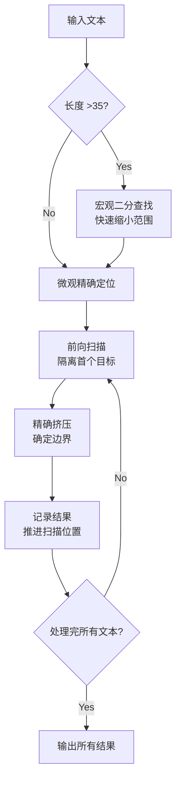

<div align="center">

# 🕵️‍♂️ LLM-Filter-Probe

[](./CHANGELOG.md)
[](https://www.python.org/)
[](https://vuejs.org/)
[](https://fastapi.tiangolo.com/)
[](./LICENSE)

**面向内容安全、风控合规与平台运营的敏感内容精确定位工具**

[功能特性](#-功能特性) •
[快速开始](#-快速开始) •
[文档索引](#-文档索引) •
[工作原理](#-工作原理) •
[免责声明](#-免责声明)

</div>

---

## 📖 项目简介

**LLM-Filter-Probe** 是一款针对 LLM 输入侧风控规则的逆向分析框架。

在当前的 LLM 中间件生态中，许多服务商（如 NEWAPI 及其兼容架构）会在**用户输入侧 (Prompt)** 实施基于字典的关键词拦截。本项目旨在通过**自动化交互探测**，利用高效的“宏观二分 + 微观精确”混合算法，在最小化 API 调用成本的前提下，精准还原目标平台实施的**敏感词过滤字典**，为风控合规研究与平台运营分析提供数据支持。

> ⚠️ **注意**：本项目仅针对基于“关键词匹配”的机械式过滤（中间层风控），无法检测 OpenAI/Claude 原生模型的语义级安全拦截。

---

## ✨ 功能特性

*   **🔍 混合探测算法 (Hybrid Algorithm)**
    *   **自适应策略**：针对长文本（50字）采用二分查找快速收敛可疑区间；针对短文本自动切换至双向挤压算法，定位精度直达**词汇级（1-3字）**。
*   **🛡️ 智能动态优化**
    *   **精准定位策略**：采用“先切片，后挤压”的原则，有效处理多个敏感词紧密相邻的复杂场景。
    *   **物理位置推进**：通过记录坐标而非文本掩码来推进扫描，确保了坐标的绝对准确性并避免了重复计算。
*   **🚀 极致性能体验**
    *   **纯异步架构**：后端基于 FastAPI 异步 I/O，前端基于 Vue 3 + WebSocket，实现扫描进度、日志流与结果的毫秒级实时回显。
    *   **高并发控制**：支持自定义并发数（1-50），内置指数退避与随机抖动重试机制，适应复杂网络环境。
*   **⚙️ 灵活配置系统**
    *   支持多层级配置（系统/用户/预设），敏感凭证分离存储，支持**配置热重载**（修改配置后无需重启服务即刻生效）。

---

## 📚 文档索引

我们为您准备了详细的工程文档，请根据需求查阅：

| 文档名称 | 内容说明 | 适用人群 |
| :--- | :--- | :--- |
| **[📄 项目概览](./PROJECT_OVERVIEW.md)** | 项目定位、核心价值、系统架构图及技术栈说明。 | 架构师、开发者 |
| **[🚀 部署指南](./DEPLOYMENT_GUIDE.md)** | 包含一键启动脚本、Docker 容器化部署及生产环境配置方案。 | 运维人员、用户 |
| **[⚙️ 参数参考](./PARAMETER_REFERENCE.md)** | `settings`、`algorithm` 及 `presets` 文件的详细参数定义与调优指南。 | 高级用户 |
| **[📝 更新日志](./CHANGELOG.md)** | 版本迭代记录、新增功能特性及已知问题修复。 | 所有用户 |

---

## ⚡ 快速开始

本项目提供开箱即用的一键启动脚本，自动处理环境依赖与服务启动。

### 1. 环境准备
确保已安装 `Python 3.9+` 和 `Node.js 16+`。

### 2. 获取代码
```bash
git clone https://github.com/soundstarrain/LLM-Filter-Probe.git
cd LLM-Filter-Probe
```

### 3. 一键启动
根据您的操作系统运行对应的启动脚本：

*   **Windows**: 双击运行 `start_system.bat`
*   **macOS / Linux**: 运行 `bash start_system.sh`

启动成功后，浏览器访问：**`http://localhost:19001`**

---

## ⭐️ 工作原理

LLM-Filter-Probe 并非简单的暴力穷举，而是通过以下逻辑最小化 API 调用：



1.  **分段预检**：对超长文本进行流式分块预处理。
2.  **宏观收敛**：对长文本递归二分切割，快速锁定包含敏感内容的小片段，然后交由微观定位处理。
3.  **微观定位**：对短文本或宏观收敛后的片段，循环执行以下操作：
    - **前向扫描**：找到第一个触发拦截的最短文本前缀，将其与后续内容物理隔离。
    - **精确挤压**：仅对该前缀进行左侧收缩，遵循“变安全则停止”原则，精确找到词语的左边界。
4.  **记录与推进**：记录找到的词及其在原始文本中的坐标，然后从该词之后的位置继续扫描，直至文本末尾。

---

## ⚠️ 免责声明

*   **合规性声明**：本项目仅供安全研究、Prompt 调试与风控机制分析使用。**严禁**用于生成违规内容、恶意攻击平台风控系统或任何违反当地法律法规的用途。
*   **风险提示**：高频的探测请求可能会触发服务商的异常检测机制（如 429 限流或封号）。请务必使用**测试账号**或**低价值 Key** 进行操作。
*   **免责条款**：开发者不对因使用本工具产生的任何直接或间接损失承担责任。

