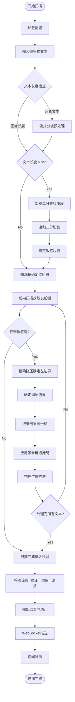

<div align="center">

# LLM-Filter-Probe

[](https://www.python.org/)
[](https://vuejs.org/)
[](https://fastapi.tiangolo.com/)
[](./LICENSE)

**面向内容安全、风控合规与平台运营的敏感内容精确定位工具**

[功能特性](#功能特性) • [演示效果](#演示效果) • [快速开始](#快速开始) • [文档索引](#文档索引) • [工作原理](#工作原理) • [免责声明](#免责声明)

</div>

---

## 项目简介

**LLM-Filter-Probe** 是一款针对大语言模型（LLM）输入侧风控规则的逆向分析框架。

许多服务商在用户输入侧实施基于字典的关键词拦截。本项目旨在通过自动化交互探测，利用“宏观二分 + 微观精确”混合算法，在最小化 API 调用成本的前提下，精准还原目标平台实施的敏感词过滤字典，为风控合规研究与平台运营分析提供数据支持。

> **注意**：本项目仅针对基于关键词匹配的机械式过滤（中间层风控），无法检测 OpenAI/Claude等模型网关和思维链的的语义安全拦截。

---

## 功能特性

本项目采用自适应混合探测算法，针对长文本使用二分查找快速收敛，针对短文本切换至双向挤压算法以达到词汇级定位精度。系统内置智能动态优化机制，通过记录坐标推进扫描并应用等长延迟掩码，结合“验证、精炼、清点”三阶段检验流程，确保结果准确并有效处理复杂相邻敏感词场景。

在架构设计上，后端基于 FastAPI 异步 I/O，前端采用 Vue 3 + WebSocket，支持毫秒级实时回显、自定义并发控制（1-50）及指数退避重试机制。配置系统支持多层级管理与热重载，扫描结果包含详细的判断依据与未知状态码统计，并提供完整的搜索与分页功能。

---

## 演示效果

**Web 操作界面与扫描结果**

系统提供清晰的实时日志、进度条与并发控制面板。扫描结果支持搜索、分页，并可追溯敏感词的判断依据。

<div align="center">


</div>

---

## 文档索引

| 文档名称 | 内容说明 | 适用人群 |
| :--- | :--- | :--- |
| **[项目概览](./PROJECT_OVERVIEW.md)** | 项目定位、核心价值、系统架构图及技术栈说明。 | 架构师、开发者 |
| **[部署指南](./DEPLOYMENT_GUIDE.md)** | 包含一键启动脚本、Docker 容器化部署及生产环境配置方案。 | 运维人员、用户 |
| **[参数参考](./PARAMETER_REFERENCE.md)** | 配置文件详细参数定义与调优指南。 | 高级用户 |
| **[更新日志](./CHANGELOG.md)** | 版本迭代记录、新增功能特性及已知问题修复。 | 所有用户 |

---

## 快速开始

### 1. 环境准备
确保已安装 Python 3.9+ 和 Node.js 16+。

### 2. 获取代码
```bash
git clone https://github.com/soundstarrain/LLM-Filter-Probe.git
cd LLM-Filter-Probe
```

### 3. 一键启动
根据操作系统运行对应的启动脚本，启动后访问 `http://localhost:19001`：
*   **Windows**: 运行 `start_system.bat`
*   **macOS / Linux**: 运行 `bash start_system.sh`

---

## 工作原理

LLM-Filter-Probe 通过以下逻辑最小化 API 调用：


```mermaid
graph TD
    Start([开始扫描]) --> LoadConfig["加载配置"]
    LoadConfig --> Input["输入待扫描文本"]
    Input --> PreCheck{"文本长度检查"}
    
    PreCheck -->|超长文本| ChunkPreprocess["流式分块预处理"]
    PreCheck -->|正常长度| LengthCheck{"文本长度 > 35?"}
    ChunkPreprocess --> LengthCheck
    
    LengthCheck -->|Yes| MacroPhase["宏观二分查找阶段"]
    LengthCheck -->|No| MicroPhase["微观精确定位阶段"]
    
    MacroPhase --> BinarySearch["递归二分切割"]
    BinarySearch --> LockSegment["锁定敏感片段"]
    LockSegment --> MicroPhase
    
    MicroPhase --> ForwardScan["前向扫描找触发前缀"]
    ForwardScan --> ScanResult{"找到敏感词?"}
    
    ScanResult -->|No| ScanEnd["扫描完成进入检验"]
    ScanResult -->|Yes| PrecisionSqueeze["精确挤压确定左边界"]
    
    PrecisionSqueeze --> LeftBoundary["确定词语边界"]
    LeftBoundary --> RecordResult["记录结果与坐标"]
    
    RecordResult --> ApplyMask["应用等长延迟掩码"]
    ApplyMask --> AdvancePos["物理位置推进"]
    
    AdvancePos --> TextEnd{"处理完所有文本?"}
    TextEnd -->|No| ForwardScan
    TextEnd -->|Yes| ScanEnd
    
    ScanEnd --> VerifyPhase["检验流程: 验证→精炼→清点"]
    
    VerifyPhase --> FinalResult["输出结果与统计"]
    FinalResult --> WebSocketPush["WebSocket推送"]
    WebSocketPush --> FrontendDisplay["前端显示"]
    FrontendDisplay --> End(["扫描完成"])
```

**核心流程说明：**

1.  **分段预检与宏观收敛**：对超长文本流式分块，利用递归二分切割快速锁定包含敏感内容的小片段。
2.  **微观定位**：在锁定的片段中，通过前向扫描找到触发拦截的最短前缀，随后进行精确挤压以确定词语左边界。
3.  **循环扫描**：记录找到的词及其绝对坐标，应用掩码后从该词之后继续扫描，直至文本结束。
4.  **三阶段检验**：扫描完成后，系统对结果进行再次验证以排除幻觉，精炼核心关键词，并进行全局清点以确保位置和数量的绝对准确。

---

## 免责声明

*   **合规性声明**：本项目仅供安全研究、Prompt 调试与风控机制分析使用。严禁用于生成违规内容、恶意攻击平台风控系统或任何违反当地法律法规的用途。
*   **风险提示**：高频探测可能触发服务商的异常检测（如 429 限流或封号）。请务必使用测试账号或低价值 Key 进行操作。
*   **免责条款**：开发者不对因使用本工具产生的任何直接或间接损失承担责任。
